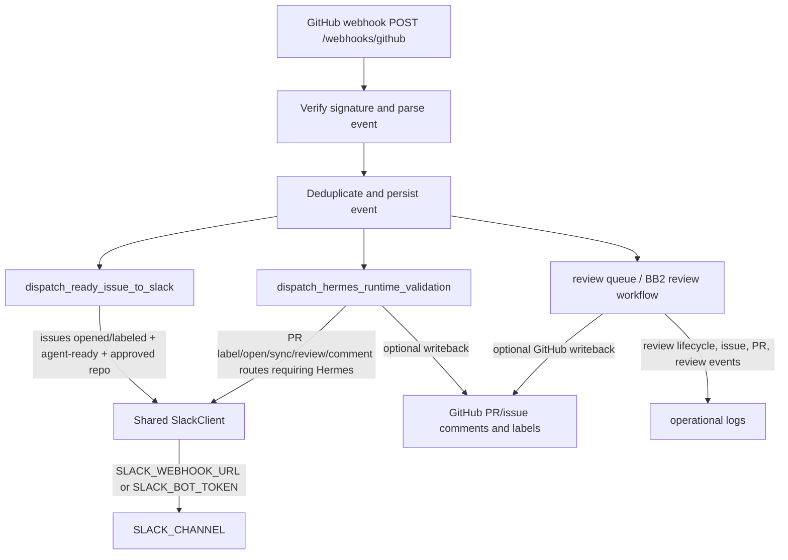

# Slack Routing Audit - June 2026

Documentation-only task.

Issue: #65 - Audit Slack routing implementation and prepare channel separation.

## Scope

This audit covers Slack message emitters and routing behavior on `agent-integration`. It does not change runtime behavior, production routing, secrets, deployment config, or branch policy.

## Slack Sender Inventory

| Source file | Function / class | Event type emitted | Webhook / API used | Channel used | Channel override supported |
|---|---|---|---|---|---|
| `app/slack_issue_dispatch.py` | `SlackClient.post_message` | Generic Slack post helper used by Circuit and Hermes paths | Uses `Settings.slack_webhook_url` as an incoming webhook when set; otherwise uses `Settings.slack_bot_token` with Slack `chat.postMessage` | Call-site supplies the `channel` argument | Yes at method level through the `channel` argument; no event-specific env split |
| `app/slack_issue_dispatch.py` | `dispatch_ready_issue_to_slack` | Circuit-ready GitHub issue notification for `issues` events | Instantiates `SlackClient(webhook_url=settings.slack_webhook_url, bot_token=settings.slack_bot_token)` | `settings.slack_channel` | Yes globally through `SLACK_CHANNEL`; no Circuit-only channel override |
| `app/slack_issue_dispatch.py` | `build_circuit_slack_message` | Message body for `@circuit-forge Circuit task ready` | None directly; text builder only | Includes the provided `channel` value in the message text | Yes only because caller passes a channel value |
| `app/hermes_dispatch.py` | `_notify_and_writeback` | Hermes validation requested / blocked / complete notifications | Reuses `SlackClient(webhook_url=settings.slack_webhook_url, bot_token=settings.slack_bot_token)` | `settings.slack_channel` | Yes globally through `SLACK_CHANNEL`; no Hermes-only channel override |
| `app/hermes_dispatch.py` | `build_hermes_slack_message` | Message body for Hermes validation requested, blocked, and complete states | None directly; text builder only | Does not choose a channel | Not applicable |
| `app/main.py` | `github_webhook` | Calls both Slack-capable dispatch paths after accepting a GitHub webhook | No direct Slack client; delegates to `dispatch_ready_issue_to_slack` and `dispatch_hermes_runtime_validation` | Delegated through `settings.slack_channel` | No separate event-specific override at the webhook entry point |

## Environment Variable Audit

| Variable | Current consumer | Current purpose | Shared across Hermes and Orchestrator paths? | Notes |
|---|---|---|---|---|
| `SLACK_WEBHOOK_URL` | `app/config.py` -> `Settings.slack_webhook_url`; consumed by `SlackClient` users | Incoming webhook URL for Slack notifications | Yes | Circuit issue notifications and Hermes runtime validation notifications both use it when present |
| `SLACK_BOT_TOKEN` | `app/config.py` -> `Settings.slack_bot_token`; consumed by `SlackClient` users | Fallback token for Slack `chat.postMessage` when no webhook URL is configured | Yes | Shared fallback for both Circuit and Hermes paths |
| `SLACK_CHANNEL` | `app/config.py` -> `Settings.slack_channel`; consumed by Circuit and Hermes dispatchers | Destination channel for Slack notifications | Yes | Default in code is `#jarvis-agent-orchestrator`; `.env.example` currently sets `#project_riseos`; README describes this as Circuit notifications |

Related Hermes env vars consumed in `app/config.py` are runtime dispatch settings, not Slack routing settings: `HERMES_BASE_URL`, `HERMES_TOKEN`, `HERMES_ENABLE_DISPATCH`, `HERMES_M2_BASE_URL`, `HERMES_M2_TOKEN`, `HERMES_M2_ENABLE_DISPATCH`, `HERMES_DGX_BASE_URL`, `HERMES_DGX_TOKEN`, `HERMES_DGX_ENABLE_DISPATCH`, and `HERMES_DEFAULT_TARGET`.

## Current Routing Map

| Event group | Current trigger / source | Current Slack route |
|---|---|---|
| Circuit lifecycle events | Circuit task-ready issues through `dispatch_ready_issue_to_slack`; branch rule and no-merge reminder included in message | Shared `SLACK_CHANNEL` |
| Issue events | `issues` action `opened` or `labeled`, approved repo, open issue, `agent-ready` label | Shared `SLACK_CHANNEL` |
| PR events | `pull_request` actions `opened`, `synchronize`, `ready_for_review`, `labeled`, `unlabeled` when Hermes labels or Circuit PR rules match | Shared `SLACK_CHANNEL` through Hermes notifier |
| Review events | `pull_request_review` action `submitted` when Hermes label requirements match | Shared `SLACK_CHANNEL` through Hermes notifier |
| Hermes dispatch requests | `_notify_and_writeback` sends a requested message before final Hermes status when Slack is configured | Shared `SLACK_CHANNEL` |
| Hermes validation results | `_notify_and_writeback` sends blocked, passed, or failed status and may write GitHub labels/comments | Shared `SLACK_CHANNEL` |
| BB2 review events | Review workflow writes operational logs and optional GitHub comments/labels; no dedicated Slack sender found for BB2 review status | No direct Slack post found beyond Hermes-triggered paths |

## Proposed Architecture

Introduce explicit Slack routing settings while preserving backward compatibility during migration:

| Proposed variable | Purpose | Fallback during migration |
|---|---|---|
| `ORCHESTRATOR_SLACK_WEBHOOK_URL` | Circuit, orchestrator, issue, PR, task-dispatch, and BB2 orchestration notifications | `SLACK_WEBHOOK_URL` |
| `ORCHESTRATOR_SLACK_CHANNEL` | Default channel for Circuit/Orchestrator events, expected `#jarvis-agent-orchestrator` | `SLACK_CHANNEL` |
| `HERMES_SLACK_WEBHOOK_URL` | Hermes runtime validation request/result telemetry | `SLACK_WEBHOOK_URL` |
| `HERMES_SLACK_CHANNEL` | Default channel for Hermes runtime telemetry, expected `#jarvis-hermes-runtime` | `SLACK_CHANNEL` |

Recommended routing rules:

| Route | Destination |
|---|---|
| Circuit task-ready issue notifications | `ORCHESTRATOR_SLACK_CHANNEL` |
| Issue queue, task dispatch, branch-policy, and no-merge/no-deploy reminders | `ORCHESTRATOR_SLACK_CHANNEL` |
| PR review lifecycle and BB2 review status notifications if Slack support is added | `ORCHESTRATOR_SLACK_CHANNEL` |
| Hermes validation requested, blocked, passed, failed, and runtime evidence notifications | `HERMES_SLACK_CHANNEL` |
| Hermes M2/DGX runtime telemetry and evidence summaries | `HERMES_SLACK_CHANNEL` |
| GitHub writeback comments and labels | Unchanged; remain GitHub-only |
| Operational logs | Unchanged; remain structured logs |

Implementation recommendation:

1. Add orchestrator and Hermes Slack fields to `Settings` with fallback to the existing `SLACK_*` variables.
2. Keep `SlackClient` as a generic transport, but provide explicit call-site routing values: Circuit/Orchestrator callers use orchestrator settings, Hermes callers use Hermes settings.
3. Keep `SLACK_WEBHOOK_URL`, `SLACK_BOT_TOKEN`, and `SLACK_CHANNEL` as deprecated compatibility inputs until deployment config is migrated.
4. Add tests proving Circuit issue dispatch posts to the orchestrator channel and Hermes validation posts to the Hermes channel when both are configured.
5. Update README and `.env.example` only after BB2 approves the config contract.

## Safety Review

- No production workflow changes were made in this audit.
- Current implementation cannot separate Circuit and Hermes Slack messages because both paths consume the same `Settings.slack_channel` and Slack credential fields.
- Circuit does not consume Slack messages directly in this repository; the risk is operational cross-talk in the shared Slack destination, not code-level ingestion of Hermes telemetry.
- Existing Slack automations should remain functional if old `SLACK_*` values remain as fallbacks during migration.
- A direct replacement without fallbacks could break production notifications if deployment secrets are not updated atomically.
- `SlackClient.post_message` already supports a channel parameter, so channel separation can be implemented at settings/call-site level without replacing the transport.

## VERIFIED

- `app/main.py` calls `dispatch_ready_issue_to_slack(parsed, settings, ...)` and `dispatch_hermes_runtime_validation(parsed, settings, ...)` for accepted GitHub webhooks.
- `app/slack_issue_dispatch.py` defines `SlackClient.post_message` and uses either `settings.slack_webhook_url` or `settings.slack_bot_token` to post Slack messages.
- `app/slack_issue_dispatch.py` routes Circuit-ready issue notifications to `settings.slack_channel`.
- `app/hermes_dispatch.py` routes Hermes validation Slack messages to `settings.slack_channel` through `_notify_and_writeback`.
- `app/config.py` currently defines `slack_webhook_url`, `slack_bot_token`, and `slack_channel` from `SLACK_WEBHOOK_URL`, `SLACK_BOT_TOKEN`, and `SLACK_CHANNEL`.
- `.env.example` currently includes `SLACK_WEBHOOK_URL`, `SLACK_BOT_TOKEN`, and `SLACK_CHANNEL` and does not include `ORCHESTRATOR_SLACK_*` or `HERMES_SLACK_*` variables.
- No dedicated BB2 Slack notification sender was found in the searched Slack emitter paths; BB2-related behavior currently appears in review workflow logs and optional GitHub writeback.

## ASSUMED

- `#jarvis-agent-orchestrator` is the desired destination for Circuit/Orchestrator events after separation, matching the Slack task text.
- `#jarvis-hermes-runtime` is the desired destination for Hermes runtime validation telemetry after separation, matching the issue background.
- The existing shared `SLACK_*` variables should remain as migration fallbacks to avoid breaking production deployments.
- Documentation-only audit findings are acceptable on `agent-integration` because the Slack task specified `agent-integration only`.

## UNVERIFIED

- Real Slack delivery was not exercised; this audit used repository inspection only.
- Runtime deployment secret values and actual production Slack webhook/channel bindings were not inspected.
- No tests were run because this task is documentation-only and no runtime code changed.
- Code search via connector did not provide a complete recursive file listing, so the inventory is based on targeted searches for Slack/webhook/channel terms plus direct inspection of the matched files.

## ARCHITECT_REVIEW_REQUIRED

BB2 should approve the env-var contract and fallback order before implementation because this is a config and routing architecture change.

## CONTRACT_CHANGE

The proposed `ORCHESTRATOR_SLACK_*` and `HERMES_SLACK_*` variables introduce a new deployment configuration contract, even though this audit does not implement it.
